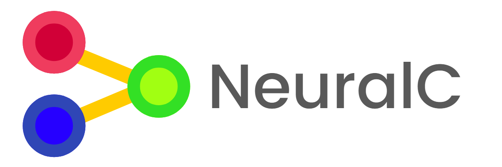

A lightweight, standalone C library for implementing deep feed-forward neural networks (DFF). It features:

- Generalized backpropagation algorithm
- Custom activation and cost-functions with hyperparameters
- Feature-rich (independent) matrix library

This is mostly a learning exercise intended to work on low level systems (i.e. Arduino).

# Dependencies

None. This is written in pure C using OS independent library functions. :)

# Basic Usage

1. Include the `Neural.h` header.
```c
#include <Neural.h>
```

2. Initialize the library's subsystems.
```c
Neural_init();
```

3. Create the structure of your network using an array of `NeuralLayers`, indicating the number of nodes per layer and their activation functions. Don't forget to set the hyperparameters of special activation functions like `Neural_activation_prelu`.
```c
// Initialize hyperparameters
HYPERPARAM_PRELU = 0.05;

NeuralLayer layers[3] = {
		{1, Neural_activation_identity},
		{5, Neural_activation_prelu},
		{1, Neural_activation_identity}
};
```

4. Generate your neural network, indicating the number of layers, the cost function, and whether or not to normalize the output with a softmax.
```c
// Layer array, number of layers, softmax normalize, cost function
NeuralNetwork *net = Neural_network(layers, 3, 0, Neural_cost_quadratic);
```

5. Load your dataset into an array of `NeuralDataSet` structures {input, desired output}.
```c
int population = 100; // 100 training examples
NeuralDataSet *data = malloc(sizeof(NeuralDataSet) * population);
```

6. Train your neural network on the dataset. Note that the population must be divisible by the batch size.
```c
int batch_size = 5; // Train network with 5 examples at a time
int passes = 1000; // Iterate over training set 1000 times
double l_rate = 0.005; // Learning rate hyperparameter

for(int i = 0; i < passes; i++) {
    Neural_network_train(net, data, population, batch_size, l_rate);
}
```

7. Free all allocated memory and close subsystems.
```c
free(data);
Neural_network_destroy(net); // Don't allow memory leaks!
Neural_quit();
```

Read `NeuralC` doc-strings and comments for more information (especially on error handling and logging).

# TODO

- Refactor code (it's really messy right now)
- Implement feature parsing engine for convolutional networks
- Read and write neural networks (and matrices) to disk
- Improve error handling