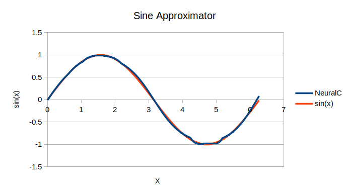

---

`NeuralC` is a lightweight, standalone C++ library for implementing deep feed-forward neural networks (DFF). It features:

- Generalized backpropagation algorithm
- A full matrix library

This is a learning exercise hobby project. Here is a visualization of the example sine approximator.



## Dependencies

None.

## Basic Usage

1. Include the `neural.h` header.
```c++
#include <neural.h>
```

2. Create a `NetworkParameters` struct that defines some key hyperparameters of the network, like the cost function and the individual layers. Each layer is defined by the number of nodes and its activation function.
```c++
neural::NetworkParameters params;
params.learning_rate = 1.0;
params.gradient_clip = 1.5;
params.cost_function = neural::quadratic_cost;
params.layers = {
    {2, nullptr},
    {2, neural::lrelu},
    {1, neural::sigmoid},
};
```

5. Generate your neural network.
```c++
neural::Network network(params);
```

6. Load your dataset into a vector of `DataSample` structures {input, desired output}.
```c++
std::vector<neural::DataSample> examples = {
    {{1.0, 0.0}, {1.0}},
    {{0.0, 1.0}, {1.0}},
    {{0.0, 0.0}, {0.0}},
    {{1.0, 1.0}, {0.0}},
};
```

7. Train your network.
```c++
int epochs = 1000;
for(int i = 0; i < epochs; i++) {
    network.fit(examples);
}
```

8. Display the output of the network by evaluating some input.
```c++
for(auto &ex : examples) {
    neural::Matrix output = network.forward(ex.input);
    for(auto &val : ex.input) {
        std::cout << int(val) << " ";
    }
    output.print();
}
```

9. Save the network to disk.
```c++
network.save("xor.net");
```

A saved neural network binary file can also be loaded from disk by calling `network.load("network_file.net")`. This assumes that the network stored on disk follows the same structure as the one it is loaded into.

Read `NeuralC` source comments for more information. View the examples for other features.

## TODO
- Reimplement hyperparameters for activation and cost functions
- Implement more activation and cost functions, including those involving vector operations

## License

Code and documentation Copyright (c) 2019-2021 Keith Leonardo

Code released under the [BSD 3 License](https://choosealicense.com/licenses/bsd-3-clause/).